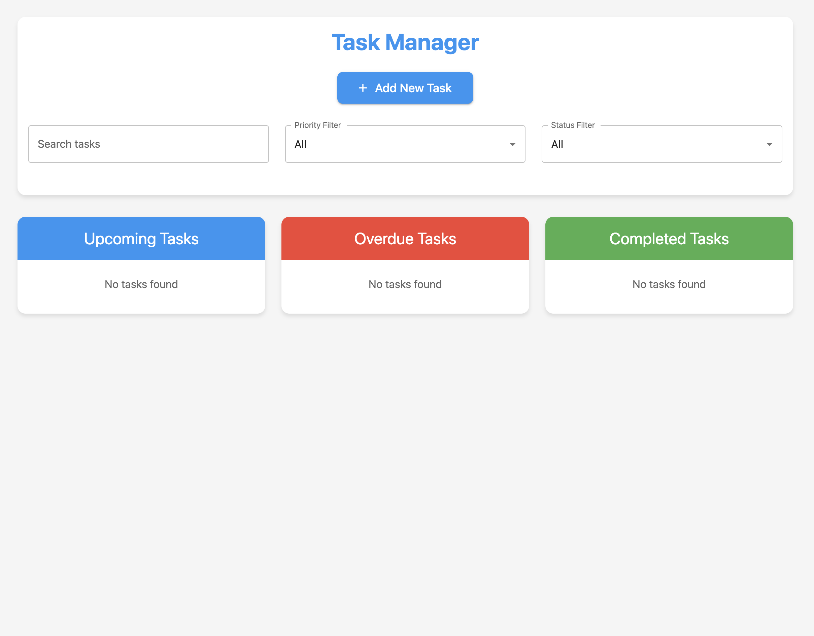
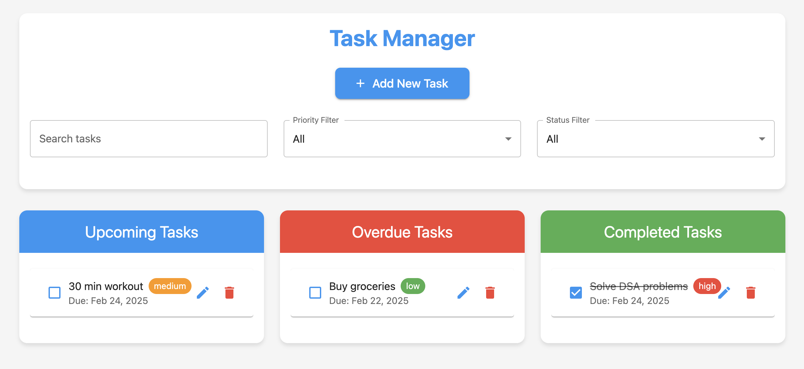

# Task Manager

A modern, responsive task management application built with React and Material-UI. This application helps users organize and track their tasks with features like priority levels, due dates, and status tracking.


## Screenshots

### Dashboard


### Task Management



## Features

- 📝 Create, edit, and delete tasks
- 🎯 Set priority levels (High, Medium, Low)
- 📅 Assign due dates to tasks
- ✅ Mark tasks as completed
- 🔍 Search and filter tasks
- 📱 Responsive design for all devices
- 💾 Local storage persistence
- 📊 Organized task views (Upcoming, Overdue, Completed)

## Technology Stack

- React 18
- Material-UI (MUI) v5
- React Router DOM v6
- date-fns for date formatting
- Local Storage for data persistence

## Installation

1. Clone the repository:
 ⁠bash
git clone https://github.com/yourusername/task-manager.git


⁠ 2. Navigate to the project directory:
 ⁠bash
cd task-manager


⁠ 3. Install dependencies:
 ⁠bash
npm install


⁠ 4. Start the development server:
 ⁠bash
npm start


The application will open in your default browser at `http://localhost:3000`.

## Usage

### Adding a Task
1. Click the "Add New Task" button
2. Fill in the task details:
   - Title (required)
   - Description (optional)
   - Due Date (required)
   - Priority Level (High/Medium/Low)
3. Click "Add Task" to save

### Managing Tasks
- **Edit**: Click the edit icon on any task to modify its details
- **Delete**: Click the delete icon to remove a task
- **Complete**: Toggle the checkbox to mark a task as complete
- **Filter**: Use the search bar and filter dropdowns to find specific tasks

## Project Structure

```
src/
├── components/
│   ├── Dashboard.js    # Main layout component
│   ├── TaskForm.js     # Task creation form
│   └── TaskList.js     # Task list display
├── context/
│   └── TaskContext.js  # Task state management
├── App.js              # Root component
└── index.js           # Entry point

```


## Usage

### Adding Tasks
- Fill in task details (title, description, due date, priority)
- Click "Add Task"

### Managing Tasks
- Edit: Click ✏️ button
- Delete: Click 🗑️ button
- Complete/Uncomplete: Click ✓ button

### Search & Filter
- Use search bar for title/description search
- Use dropdowns to filter by priority and status